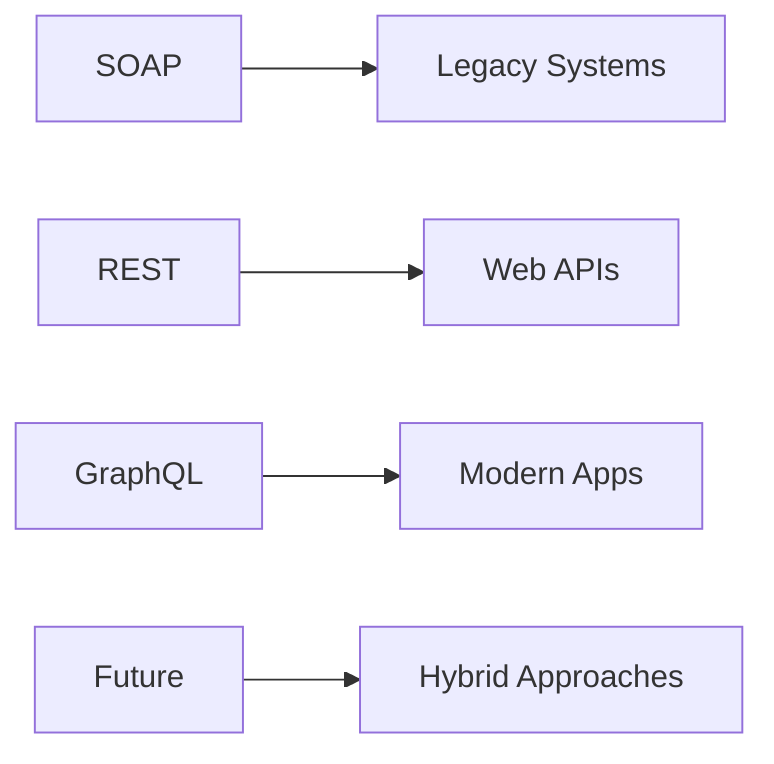

# REST vs SOAP vs GraphQL

## Introduction

Maintenant que nous avons exploré l'histoire des APIs, il est temps de comprendre les différentes architectures disponibles aujourd'hui. Dans ce chapitre, nous allons comparer les trois principales approches : **SOAP**, **REST** et **GraphQL**. Cette comparaison vous aidera à choisir la bonne solution selon vos besoins.

## SOAP (Simple Object Access Protocol)

### Qu'est-ce que SOAP ?

SOAP est un protocole de communication basé sur XML qui a été standardisé au début des années 2000.

```xml
<!-- Enveloppe SOAP -->
<soap:Envelope xmlns:soap="http://schemas.xmlsoap.org/soap/envelope/">
  <soap:Header>
    <auth:Authentication xmlns:auth="...">
      <auth:username>user</auth:username>
      <auth:password>pass</auth:password>
    </auth:Authentication>
  </soap:Header>
  <soap:Body>
    <getUserRequest>
      <userId>123</userId>
    </getUserRequest>
  </soap:Body>
</soap:Envelope>
```

### Avantages de SOAP

#### 1. **Standardisation stricte**
- **WSDL** (Web Services Description Language)
- Contrats formels entre client et serveur
- **Type safety** : Vérification des types à la compilation

#### 2. **Fonctionnalités avancées**
```xml
<!-- SOAP supporte les transactions -->
<soap:Header>
  <transaction:TransactionID>tx-123</transaction:TransactionID>
</soap:Header>
```

#### 3. **Sécurité intégrée**
- **WS-Security** : Signature et chiffrement des messages
- **WS-Trust** : Gestion des identités
- **WS-Policy** : Définition des politiques de sécurité

### Inconvénients de SOAP

#### 1. **Complexité**
```bash
# Installation SOAP typique
npm install soap
# vs REST simple
npm install axios
```

#### 2. **Performance**
- **XML parsing** coûteux
- **Enveloppe SOAP** ajoute de l'overhead
- **Messages plus volumineux**

#### 3. **Rigidité**
- Contrats WSDL figés
- Difficile à évoluer
- **Tight coupling** entre client et serveur

### Exemple SOAP complet

**WSDL**
```xml
<definitions name="UserService"
             targetNamespace="http://example.com/users">
  <types>
    <xsd:schema>
      <xsd:element name="getUser">
        <xsd:complexType>
          <xsd:sequence>
            <xsd:element name="id" type="xsd:int"/>
          </xsd:sequence>
        </xsd:complexType>
      </xsd:element>
    </xsd:schema>
  </types>
</definitions>
```

## REST (Representational State Transfer)

### Qu'est-ce que REST ?

REST est un **style architectural** défini par Roy Fielding en 2000. Il utilise les principes du Web.

```javascript
// API REST simple avec Express
const express = require('express');
const app = express();

app.get('/api/users/:id', (req, res) => {
  const user = getUserFromDatabase(req.params.id);
  res.json(user);
});

app.post('/api/users', (req, res) => {
  const newUser = createUser(req.body);
  res.status(201).json(newUser);
});
```

### Avantages de REST

#### 1. **Simplicité**
```bash
# Requêtes REST intuitives
GET /api/users          # Tous les utilisateurs
GET /api/users/123      # Utilisateur 123
POST /api/users         # Créer un utilisateur
PUT /api/users/123      # Mettre à jour l'utilisateur 123
DELETE /api/users/123   # Supprimer l'utilisateur 123
```

#### 2. **Performance**
```json
// Réponse JSON légère
{
  "id": 123,
  "name": "John Doe",
  "email": "john@example.com"
}
```

#### 3. **Évolutivité**
```javascript
// REST est stateless
app.get('/api/users/:id', (req, res) => {
  // Pas besoin de session ou de contexte
  const user = database.getUser(req.params.id);
  res.json(user);
});
```

#### 4. **Cacheable**
```http
# Les réponses GET peuvent être mises en cache
GET /api/users/123
Cache-Control: max-age=3600
```

### Inconvénients de REST

#### 1. **Sur-fetching / Under-fetching**
```javascript
// Problème 1: Sur-fetching
GET /api/users/123
// Retourne TOUTES les données utilisateur
// même si on ne veut que le nom

// Problème 2: Under-fetching
GET /api/users/123      // → données basiques
GET /api/users/123/posts  // → posts de l'utilisateur
// → 2 requêtes nécessaires
```

#### 2. **Pas de type safety**
```javascript
// Le client ne sait pas la structure des données
fetch('/api/users/123')
  .then(response => response.json())
  .then(data => {
    // Que contient data ? Pas de garantie !
  });
```

#### 3. **Versioning difficile**
```
/api/v1/users
/api/v2/users
/api/v3/users
```

## GraphQL

### Qu'est-ce que GraphQL ?

GraphQL est un langage de requête et un runtime créé par Facebook en 2012, rendu public en 2015.

```graphql
# Schéma GraphQL
type User {
  id: ID!
  name: String!
  email: String!
  posts: [Post!]!
}

type Query {
  user(id: ID!): User
  users: [User!]!
}
```

```javascript
// Requête GraphQL
const query = `
  query {
    user(id: "123") {
      name
      email
      posts {
        title
        content
      }
    }
  }
`;
```

### Avantages de GraphQL

#### 1. **Requêtes précises**
```graphql
# Je demande exactement ce dont j'ai besoin
query {
  user(id: "123") {
    name        # ← Seulement le nom
    email       # ← Et l'email
    # Pas les autres champs !
  }
}
```

#### 2. **Réduction des requêtes**
```graphql
# Une seule requête pour tout !
query {
  user(id: "123") {
    name
    posts {
      title
      author {
        name
      }
    }
  }
}
```

#### 3. **Type Safety**
```graphql
# Le schéma définit les types
type User {
  id: ID!           # Non-nullable
  name: String!     # Non-nullable string
  email: String     # Nullable string
}
```

#### 4. **Introspection**
```graphql
# GraphQL peut se décrire lui-même
query {
  __schema {
    types {
      name
      fields {
        name
        type
      }
    }
  }
}
```

### Inconvénients de GraphQL

#### 1. **Complexité d'implémentation**
```javascript
// Setup GraphQL plus complexe
const { ApolloServer, gql } = require('apollo-server');

const typeDefs = gql`
  type User {
    id: ID!
    name: String!
  }
`;

const resolvers = {
  Query: {
    user: (parent, args) => getUser(args.id)
  }
};
```

#### 2. **Cache plus difficile**
```graphql
# Problème de cache avec GraphQL
query {
  user(id: "123") {
    name
    # Comment mettre en cache cette requête ?
  }
}
```

#### 3. **N+1 Query Problem**
```javascript
// Peut causer des problèmes de performance
query {
  users {
    id
    posts {  # ← N requêtes supplémentaires !
      title
    }
  }
}
```

## Comparaison directe

### Critères de choix

| Critère | SOAP | REST | GraphQL |
|---------|------|------|---------|
| **Simplicité** | ❌ Complexe | ✅ Simple | ⚠️ Moyenne |
| **Performance** | ❌ Lourd | ✅ Léger | ✅ Efficace |
| **Type Safety** | ✅ WSDL | ❌ Runtime | ✅ Schema |
| **Évolutivité** | ❌ Rigide | ✅ Flexible | ✅ Très flexible |
| **Cache** | ❌ Difficile | ✅ HTTP Cache | ⚠️ Complexe |
| **Mobile** | ❌ Verbeux | ✅ Efficace | ✅ Très efficace |

### Cas d'usage typiques

#### SOAP : Entreprise & Legacy
```xml
<!-- Parfait pour les systèmes bancaires -->
<soap:Body>
  <transferFunds>
    <fromAccount>12345</fromAccount>
    <toAccount>67890</toAccount>
    <amount>1000.00</amount>
  </transferFunds>
</soap:Body>
```

#### REST : APIs Web & Mobile
```javascript
// Parfait pour les applications web
GET /api/products
POST /api/orders
PUT /api/users/123
```

#### GraphQL : Applications complexes
```graphql
# Parfait pour Facebook-like apps
query {
  user {
    profile {
      name
      avatar
    }
    friends {
      profile {
        name
      }
      recentPosts {
        content
        likes
      }
    }
  }
}
```

## Exemple comparatif complet

### Même opération avec les 3 approches

#### SOAP
```xml
POST /UserService HTTP/1.1
Content-Type: text/xml; charset=utf-8

<soap:Envelope>
  <soap:Body>
    <getUserDetails>
      <userId>123</userId>
    </getUserDetails>
  </soap:Body>
</soap:Envelope>
```

#### REST
```bash
GET /api/users/123 HTTP/1.1
Accept: application/json
```

#### GraphQL
```graphql
query {
  user(id: "123") {
    id
    name
    email
  }
}
```

### Réponses

#### SOAP (volumineux)
```xml
<soap:Envelope>
  <soap:Body>
    <getUserDetailsResponse>
      <user>
        <id>123</id>
        <name>John Doe</name>
        <email>john@example.com</email>
        <createdDate>2023-10-25</createdDate>
        <!-- ... 20 autres champs ... -->
      </user>
    </getUserDetailsResponse>
  </soap:Body>
</soap:Envelope>
```

#### REST (léger)
```json
{
  "id": 123,
  "name": "John Doe",
  "email": "john@example.com"
}
```

#### GraphQL (précis)
```json
{
  "data": {
    "user": {
      "id": "123",
      "name": "John Doe",
      "email": "john@example.com"
    }
  }
}
```

## Tendances et avenir

### Évolution des usages



### Hybrid Approaches
```javascript
// REST pour les opérations simples
GET /api/users/123

// GraphQL pour les requêtes complexes
query {
  user(id: "123") {
    profile
    posts {
      title
      comments {
        author
      }
    }
  }
}
```

## Recommandations

### Quand utiliser SOAP ?
- ✅ **Systèmes legacy** à intégrer
- ✅ **Environnements d'entreprise** stricts
- ✅ **Besoins de sécurité** avancés (WS-Security)
- ✅ **Contrats formels** requis

### Quand utiliser REST ?
- ✅ **APIs Web** et mobiles
- ✅ **Développement rapide**
- ✅ **Équipes distribuées**
- ✅ **Performance** importante

### Quand utiliser GraphQL ?
- ✅ **Applications complexes** avec données liées
- ✅ **APIs mobiles** (réduction du trafic)
- ✅ **Frontend flexible** (SPA, React, Vue)
- ✅ **Évolution rapide** des besoins

## Quiz comparatif

**Question 1** : Quel protocole est le plus adapté pour une application mobile ?
**Réponse** : GraphQL (trafic réseau optimisé)

**Question 2** : Pour un système bancaire legacy, que choisir ?
**Réponse** : SOAP (sécurité et contrats stricts)

**Question 3** : Pour une API de startup à développer rapidement ?
**Réponse** : REST (simplicité et rapidité)

## En résumé

| Aspect | SOAP | REST | GraphQL |
|--------|------|------|---------|
| **Complexité** | Haute | Basse | Moyenne |
| **Performance** | Basse | Haute | Haute |
| **Flexibilité** | Basse | Moyenne | Haute |
| **Type Safety** | Compile-time | Runtime | Build-time |
| **Évolutivité** | Difficile | Facile | Très facile |

Le choix dépend de vos **besoins spécifiques** :
- **SOAP** pour l'entreprise legacy
- **REST** pour la simplicité
- **GraphQL** pour la flexibilité

Dans les prochains chapitres, nous nous concentrerons sur REST, car c'est le standard le plus répandu et le plus accessible pour débuter !

---

**Prochain chapitre** : [04-Cases-d-usage-APIs-REST](04-Cases-d-usage-APIs-REST.md)
