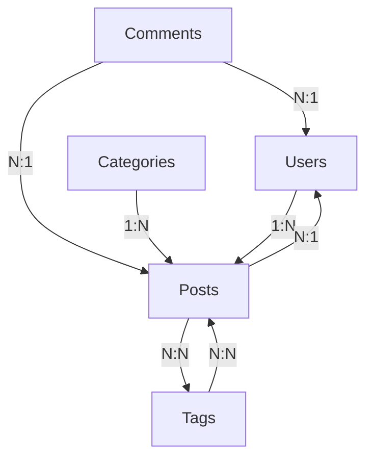
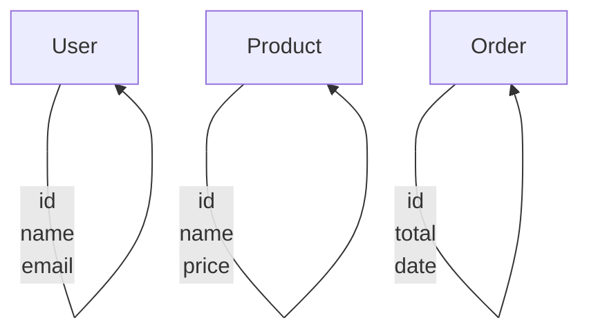
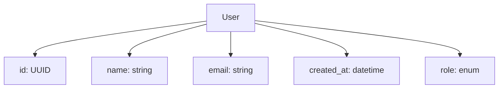
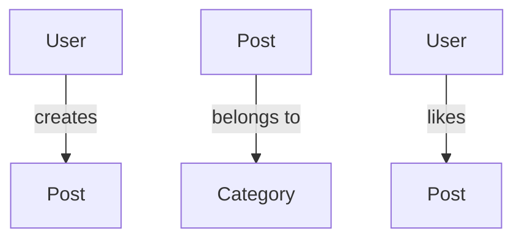
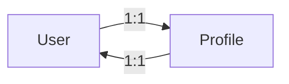
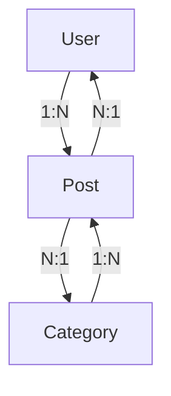
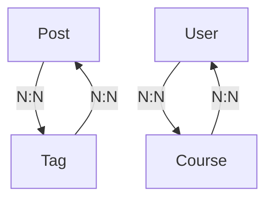
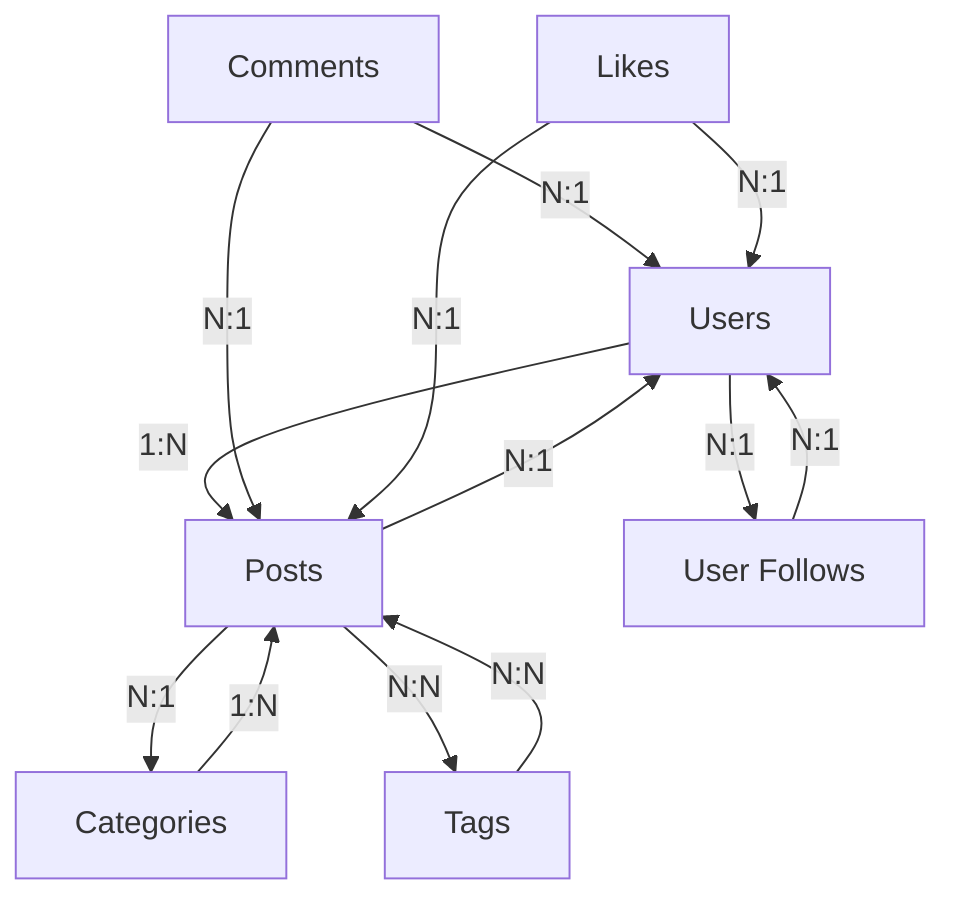
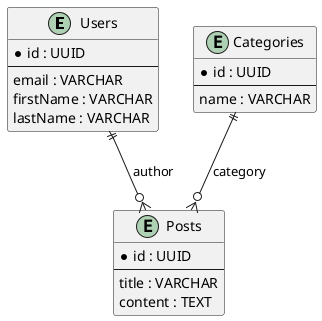
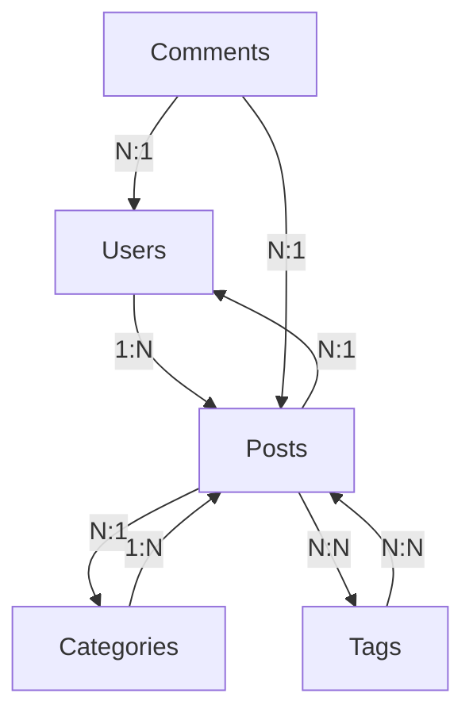

# ERD et Relations

## Introduction

Dans les chapitres précédents, nous avons modélisé les ressources individuellement et conçu des URLs. Maintenant, concentrons-nous sur les **relations entre ressources**. Un Entity-Relationship Diagram (ERD) est un outil puissant pour visualiser et comprendre comment les différentes entités de votre domaine interagissent. Dans ce chapitre, nous allons apprendre à créer des ERDs et à implémenter les relations dans une API REST.

## Qu'est-ce qu'un ERD ?

### Définition

Un **Entity-Relationship Diagram** (Diagramme Entité-Relation) est une représentation visuelle des entités (ressources) de votre système et des relations qui les lient.



### Composants d'un ERD

#### 1. Entités (Entities)


#### 2. Attributs (Attributes)


#### 3. Relations (Relationships)


## Types de relations

### 1. One-to-One (1:1)

#### Définition
Une entité A est liée à exactement une entité B, et réciproquement.



#### Exemples
```javascript
// Profil utilisateur
const User = {
  id: "UUID",
  profile: "Profile" // One-to-One
};

const Profile = {
  id: "UUID",
  userId: "UUID (FK)",
  bio: "string",
  avatar: "string"
};
```

#### API Design
```javascript
// ✅ Ressource liée
GET /api/users/123/profile
PUT /api/users/123/profile

// ✅ Ou intégrée dans la ressource principale
GET /api/users/123
{
  "id": 123,
  "name": "John Doe",
  "profile": {
    "bio": "Software developer",
    "avatar": "https://..."
  }
}
```

### 2. One-to-Many (1:N)

#### Définition
Une entité A peut être liée à plusieurs entités B, mais chaque entité B n'est liée qu'à une seule entité A.



#### Exemples
```javascript
// Articles d'un utilisateur
const User = {
  id: "UUID",
  posts: "Post[]" // One-to-Many
};

const Post = {
  id: "UUID",
  authorId: "UUID (FK)", // Many-to-One
  title: "string"
};
```

#### API Design
```javascript
// ✅ Sous-ressource
GET /api/users/123/posts
POST /api/users/123/posts

// ✅ Query parameter (alternative)
GET /api/posts?author_id=123

// ✅ Ressource principale avec relation
GET /api/posts/456
{
  "id": 456,
  "title": "Introduction à REST",
  "author": {
    "id": 123,
    "name": "John Doe"
  }
}
```

### 3. Many-to-Many (N:N)

#### Définition
Plusieurs entités A peuvent être liées à plusieurs entités B, et réciproquement.



#### Exemples
```javascript
// Articles et tags
const Post = {
  id: "UUID",
  tags: "Tag[]" // Many-to-Many
};

const Tag = {
  id: "UUID",
  posts: "Post[]" // Many-to-Many
};

// Via table de liaison
const PostTag = {
  postId: "UUID (FK)",
  tagId: "UUID (FK)"
};
```

#### API Design
```javascript
// ✅ Des deux côtés
GET /api/posts/456/tags
POST /api/posts/456/tags
DELETE /api/posts/456/tags/789

GET /api/tags/789/posts
POST /api/tags/789/posts

// ✅ Ressource de liaison (optionnel)
GET /api/posts/456/tags
{
  "data": [
    {"id": 1, "name": "JavaScript"},
    {"id": 2, "name": "REST"}
  ],
  "_links": {
    "post": "/api/posts/456",
    "tags": [
      "/api/tags/1",
      "/api/tags/2"
    ]
  }
}
```

## Design des relations dans REST

### Relations One-to-Many

```javascript
// Pattern recommandé
GET /api/users/123/posts        // Posts de l'utilisateur
POST /api/users/123/posts       // Créer un post pour l'utilisateur

GET /api/posts/456/comments     // Commentaires du post
POST /api/posts/456/comments    // Ajouter un commentaire

// Relations dans les deux sens
GET /api/posts?author_id=123    // Alternative avec query
GET /api/comments?post_id=456   // Alternative avec query
```

### Relations Many-to-Many

```javascript
// Via sous-ressources
GET /api/posts/456/tags         // Tags du post
POST /api/posts/456/tags        // Ajouter un tag
DELETE /api/posts/456/tags/789  // Retirer un tag

GET /api/tags/789/posts         // Posts du tag
POST /api/tags/789/posts        // Ajouter un post au tag

// Via ressource de liaison
POST /api/post-tags             // Créer la liaison
DELETE /api/post-tags?post_id=456&tag_id=789
```

### Relations avec métadonnées

```javascript
// Relation avec des données supplémentaires
const UserCourse = {
  userId: "UUID (FK)",
  courseId: "UUID (FK)",
  enrolledAt: "datetime",
  progress: "decimal",
  completed: "boolean"
};

// API
GET /api/users/123/courses
{
  "data": [
    {
      "course": {"id": 1, "title": "REST APIs"},
      "enrolledAt": "2023-10-01",
      "progress": 75.5,
      "completed": false
    }
  ]
}
```

## Clés étrangères et contraintes

### Foreign Keys (FK)

```javascript
// Dans la base de données
CREATE TABLE posts (
  id UUID PRIMARY KEY,
  title VARCHAR(255) NOT NULL,
  author_id UUID NOT NULL,
  category_id UUID,
  FOREIGN KEY (author_id) REFERENCES users(id),
  FOREIGN KEY (category_id) REFERENCES categories(id)
);

// Dans le code
const Post = {
  id: "UUID",
  title: "string",
  authorId: "UUID (FK)",     // Référence vers User
  categoryId: "UUID (FK)",    // Référence vers Category
  author: "User",            // Objet lié (via include)
  category: "Category"       // Objet lié (via include)
};
```

### Contraintes de base de données

```sql
-- Contrainte NOT NULL
ALTER TABLE posts ADD CONSTRAINT fk_author
FOREIGN KEY (author_id) REFERENCES users(id) NOT NULL;

-- Contrainte CASCADE
ALTER TABLE posts ADD CONSTRAINT fk_author
FOREIGN KEY (author_id) REFERENCES users(id)
ON DELETE CASCADE;  -- Supprimer les posts si l'auteur est supprimé

-- Contrainte RESTRICT
ALTER TABLE posts ADD CONSTRAINT fk_category
FOREIGN KEY (category_id) REFERENCES categories(id)
ON DELETE RESTRICT;  -- Empêcher la suppression si des posts existent
```

## Implémentation des relations

### 1. Embedding vs Linking

#### Embedding (intégration)
```javascript
// ✅ Inclure les relations dans la réponse
GET /api/users/123
{
  "id": 123,
  "name": "John Doe",
  "posts": [
    {
      "id": 1,
      "title": "Mon premier post",
      "content": "..."
    }
  ]
}

// ✅ Avantages
✅ Réponse complète en une requête
✅ Pas de requêtes supplémentaires
✅ Performance client

// ✅ Inconvénients
❌ Données potentiellement volumineuses
❌ Cache plus complexe
❌ Pas de contrôle fin sur les relations
```

#### Linking (liens)
```javascript
// ✅ Liens vers les ressources liées
GET /api/users/123
{
  "id": 123,
  "name": "John Doe",
  "_links": {
    "posts": "/api/users/123/posts",
    "self": "/api/users/123"
  }
}

// ✅ Avantages
✅ Réponses légères
✅ Cache indépendant
✅ Contrôle fin des relations

// ✅ Inconvénients
❌ Requêtes supplémentaires nécessaires
❌ Latence réseau
❌ Complexité client
```

### 2. Lazy Loading vs Eager Loading

```javascript
// Lazy Loading (chargement paresseux)
app.get('/api/users/:id', async (req, res) => {
  const user = await User.findByPk(req.params.id);
  // Relations chargées à la demande
  res.json(user);
});

// Eager Loading (chargement anticipé)
app.get('/api/users/:id', async (req, res) => {
  const user = await User.findByPk(req.params.id, {
    include: [
      { model: Post, include: [Comment] },
      { model: Profile }
    ]
  });
  res.json(user);
});
```

### 3. Pagination des relations

```javascript
// ✅ Pagination des relations
GET /api/users/123/posts?page=2&per_page=10

{
  "data": [...],
  "pagination": {
    "page": 2,
    "per_page": 10,
    "total": 45
  },
  "_links": {
    "next": "/api/users/123/posts?page=3&per_page=10",
    "prev": "/api/users/123/posts?page=1&per_page=10"
  }
}
```

## Exemple complet : Blog API avec ERD

### ERD du Blog



### Modèle de données

```javascript
// User (entité principale)
const User = {
  id: "UUID PRIMARY KEY",
  email: "string UNIQUE NOT NULL",
  firstName: "string",
  lastName: "string",
  avatar: "string",
  bio: "string",
  createdAt: "datetime",
  updatedAt: "datetime",

  // Relations
  posts: "Post[]",
  comments: "Comment[]",
  following: "User[]",     // Utilisateurs suivis
  followers: "User[]",     // Abonnés
  likes: "Like[]"
};

// Post (entité principale)
const Post = {
  id: "UUID PRIMARY KEY",
  title: "string NOT NULL",
  content: "text",
  published: "boolean DEFAULT false",
  publishedAt: "datetime",
  createdAt: "datetime",
  updatedAt: "datetime",

  // Foreign Keys
  authorId: "UUID NOT NULL (FK -> users.id)",
  categoryId: "UUID (FK -> categories.id)",

  // Relations
  author: "User",
  category: "Category",
  comments: "Comment[]",
  tags: "Tag[]",
  likes: "Like[]"
};

// Relations Many-to-Many via tables de liaison
const PostTag = {
  postId: "UUID (FK -> posts.id)",
  tagId: "UUID (FK -> tags.id)",
  createdAt: "datetime"
};
```

### API Endpoints

```javascript
// Users endpoints
GET /api/v1/users                    // Liste utilisateurs
GET /api/v1/users/123                // Profil utilisateur
POST /api/v1/users                   // Créer utilisateur
PUT /api/v1/users/123                // Modifier profil
DELETE /api/v1/users/123             // Supprimer compte

// Relations utilisateurs
GET /api/v1/users/123/posts          // Posts de l'utilisateur
GET /api/v1/users/123/followers      // Abonnés
GET /api/v1/users/123/following      // Utilisateurs suivis
GET /api/v1/users/123/likes          // Posts aimés

// Posts endpoints
GET /api/v1/posts                    // Liste posts
GET /api/v1/posts/456                // Post spécifique
POST /api/v1/posts                   // Créer post
PUT /api/v1/posts/456                // Modifier post
DELETE /api/v1/posts/456             // Supprimer post

// Relations posts
GET /api/v1/posts/456/comments       // Commentaires du post
GET /api/v1/posts/456/tags           // Tags du post
GET /api/v1/posts/456/likes          // Likes du post

// Actions sur posts
POST /api/v1/posts/456/publish       // Publier
POST /api/v1/posts/456/unpublish     // Dépublier
POST /api/v1/posts/456/like          // Aimer
POST /api/v1/posts/456/unlike        // Ne plus aimer

// Comments endpoints
GET /api/v1/comments                 // Tous commentaires
POST /api/v1/posts/456/comments      // Ajouter commentaire
PUT /api/v1/comments/789             // Modifier commentaire
DELETE /api/v1/comments/789          // Supprimer commentaire

// Categories endpoints
GET /api/v1/categories               // Toutes catégories
GET /api/v1/categories/123           // Catégorie spécifique
GET /api/v1/categories/123/posts     // Posts de la catégorie

// Tags endpoints
GET /api/v1/tags                     // Tous tags
GET /api/v1/tags/456                 // Tag spécifique
GET /api/v1/tags/456/posts           // Posts du tag

// Actions sociales
POST /api/v1/users/123/follow        // Suivre utilisateur
POST /api/v1/users/123/unfollow      // Ne plus suivre
```

### Implémentation Express

```javascript
const express = require('express');
const app = express();

app.use(express.json());

// GET user with relations
app.get('/api/v1/users/:id', async (req, res) => {
  const user = await User.findByPk(req.params.id, {
    include: [
      {
        model: Post,
        as: 'posts',
        include: [
          { model: Category, as: 'category' },
          { model: Tag, as: 'tags' }
        ]
      },
      {
        model: User,
        as: 'followers',
        attributes: ['id', 'name', 'avatar']
      },
      {
        model: User,
        as: 'following',
        attributes: ['id', 'name', 'avatar']
      }
    ]
  });

  if (!user) {
    return res.status(404).json({
      error: 'User not found',
      message: `No user found with id ${req.params.id}`
    });
  }

  res.json({
    data: user,
    _links: {
      self: `/api/v1/users/${req.params.id}`,
      posts: `/api/v1/users/${req.params.id}/posts`,
      followers: `/api/v1/users/${req.params.id}/followers`,
      following: `/api/v1/users/${req.params.id}/following`
    }
  });
});

// GET posts with filtering by relations
app.get('/api/v1/posts', async (req, res) => {
  const whereClause = {};
  const includeClause = [];

  // Filtrage par auteur
  if (req.query.author_id) {
    whereClause.authorId = req.query.author_id;
  }

  // Filtrage par catégorie
  if (req.query.category_id) {
    whereClause.categoryId = req.query.category_id;
  }

  // Filtrage par tags
  if (req.query.tag_id) {
    includeClause.push({
      model: Tag,
      as: 'tags',
      where: { id: req.query.tag_id },
      required: true
    });
  }

  // Includes pour les relations
  includeClause.push(
    { model: User, as: 'author' },
    { model: Category, as: 'category' },
    { model: Tag, as: 'tags' },
    { model: Comment, as: 'comments' }
  );

  const posts = await Post.findAll({
    where: whereClause,
    include: includeClause,
    limit: parseInt(req.query.limit) || 20,
    offset: (parseInt(req.query.page) - 1) * parseInt(req.query.limit) || 0,
    order: [[req.query.sort || 'createdAt', req.query.order || 'DESC']]
  });

  res.json({
    data: posts,
    pagination: {
      page: parseInt(req.query.page) || 1,
      limit: parseInt(req.query.limit) || 20,
      total: await Post.count({ where: whereClause })
    }
  });
});

// POST create post with relations
app.post('/api/v1/posts', async (req, res) => {
  const { title, content, categoryId, tagIds } = req.body;

  try {
    const newPost = await Post.create({
      title,
      content,
      authorId: req.user.id, // Utilisateur connecté
      categoryId,
      published: false
    });

    // Créer les relations many-to-many avec les tags
    if (tagIds && tagIds.length > 0) {
      await newPost.setTags(tagIds);
    }

    // Récupérer le post avec ses relations
    const postWithRelations = await Post.findByPk(newPost.id, {
      include: [
        { model: User, as: 'author' },
        { model: Category, as: 'category' },
        { model: Tag, as: 'tags' }
      ]
    });

    res.status(201)
       .header('Location', `/api/v1/posts/${newPost.id}`)
       .json({
         data: postWithRelations,
         _links: {
           self: `/api/v1/posts/${newPost.id}`,
           publish: `/api/v1/posts/${newPost.id}/publish`
         }
       });
  } catch (error) {
    res.status(400).json({
      error: 'Validation failed',
      message: error.message
    });
  }
});

// Many-to-many: Add tags to post
app.post('/api/v1/posts/:postId/tags', async (req, res) => {
  const { tagId } = req.body;
  const post = await Post.findByPk(req.params.postId);

  if (!post) {
    return res.status(404).json({ error: 'Post not found' });
  }

  const tag = await Tag.findByPk(tagId);
  if (!tag) {
    return res.status(404).json({ error: 'Tag not found' });
  }

  await post.addTag(tag);

  res.status(201).json({
    message: 'Tag added to post successfully',
    data: { postId: req.params.postId, tagId }
  });
});

// Many-to-many: Remove tag from post
app.delete('/api/v1/posts/:postId/tags/:tagId', async (req, res) => {
  const post = await Post.findByPk(req.params.postId);
  if (!post) {
    return res.status(404).json({ error: 'Post not found' });
  }

  const tag = await Tag.findByPk(req.params.tagId);
  if (!tag) {
    return res.status(404).json({ error: 'Tag not found' });
  }

  await post.removeTag(tag);

  res.status(204).send();
});
```

## Outils pour créer des ERDs

### 1. Draw.io (gratuit)

```mermaid
// Syntaxe simple pour créer des ERDs
graph TD
    A[Users] -->|1:N| B[Posts]
    B -->|N:1| A
    C[Categories] -->|1:N| B
    D[Tags] -->|N:N| B
```

### 2. Lucidchart

- Interface graphique intuitive
- Templates ERD prédéfinis
- Collaboration en temps réel

### 3. DB Designer

- Spécialisé pour les bases de données
- Génère le SQL automatiquement
- Support des contraintes

### 4. PlantUML



## Quiz des ERD et Relations

**Question 1** : Quelle est la notation pour une relation one-to-many ?
**Réponse** : 1:N (un utilisateur a plusieurs posts)

**Question 2** : Comment implémenter une relation many-to-many en base de données ?
**Réponse** : Via une table de liaison avec deux foreign keys

**Question 3** : Quelle est la différence entre embedding et linking ?
**Réponse** : Embedding inclut les relations dans la réponse, linking utilise des URLs

## En résumé

### Types de relations
1. **One-to-One (1:1)** : Ressource liée directement
2. **One-to-Many (1:N)** : Sous-ressources ou query parameters
3. **Many-to-Many (N:N)** : Table de liaison ou sous-ressources bidirectionnelles

### Bonnes pratiques
- ✅ **Foreign keys** avec contraintes appropriées
- ✅ **Navigation cohérente** dans les deux sens
- ✅ **Pagination** des relations volumineuses
- ✅ **Documentation** des relations dans OpenAPI

### Structure API recommandée
```javascript
// Ressource principale
GET /api/users/123

// Relations one-to-many
GET /api/users/123/posts
GET /api/posts/456/comments

// Relations many-to-many
GET /api/posts/456/tags
GET /api/tags/789/posts

// Actions sur relations
POST /api/posts/456/tags
DELETE /api/posts/456/tags/789
```

### ERD complet


Dans le prochain chapitre, nous explorerons la **gestion des versions** d'API et comment faire évoluer votre API sans casser la compatibilité !

---

**Prochain chapitre** : [04-Versionning-de-l-API](04-Versionning-de-l-API.md)
